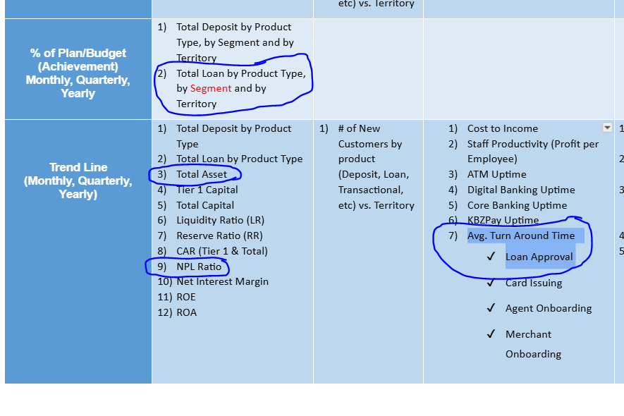

# May 21 , we discuss on Loan Approval

- loan data is taken from risk team by ACOE
- now credit function report loan data on 
colletral type , product type , sector type
- history loan approval is working on manual 
is not easy for them , and system data is not ready.
- SME loans are tested in pilot.
- loan approval standard SLA will setup for phase 1 
- current workflow and SLA will be shown in BI
- we need loan End to End SLA , not only credit function SLA
- SME loans are doing with los system but it is in pilot.
- current los system is not testing  all SME , selected branches and product may be.
- working with ma cherry in SME los
- credit function need to know total asset
- credit function need to know NPL ratio
- credit function will disscuss on loan approval 