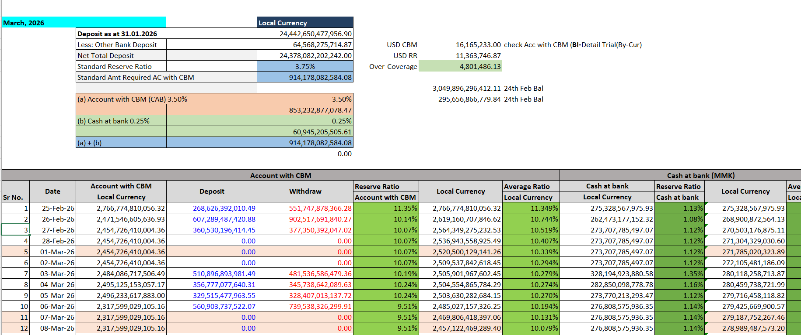

# Reserve Requirement Ratio (RRR) in banking
RR Ratio = “အရန်ငွေ ထားရှိရမည့် အချိုး”

🧾 Explanation (simple)

RR Ratio ဆိုတာက
ဘဏ်တစ်ခုက သူတို့ရဲ့ deposit (အပ်ငွေ) ထဲက ဘယ်လောက်ကို
Central Bank (ဗဟိုဘဏ်) မှာ မသုံးဘဲ အရန်အဖြစ်ထားရမယ်ဆိုတဲ့ အချိုး ပါ။

# calulation

if RR ratio is greater than the defined ratio from CBM , it is ok

CBM split into 2 ratio as follow
- Total = 3.75%
- Account with cbm = 3.5%
- Cash at bank = 0.25%

Customer Deposit = Total Deposit - other bank deposit 

RR = Account_with_cbm / Customer Deposit

reverse ratio with cash = cash at bank / Customer Deposit

----------- working pic

