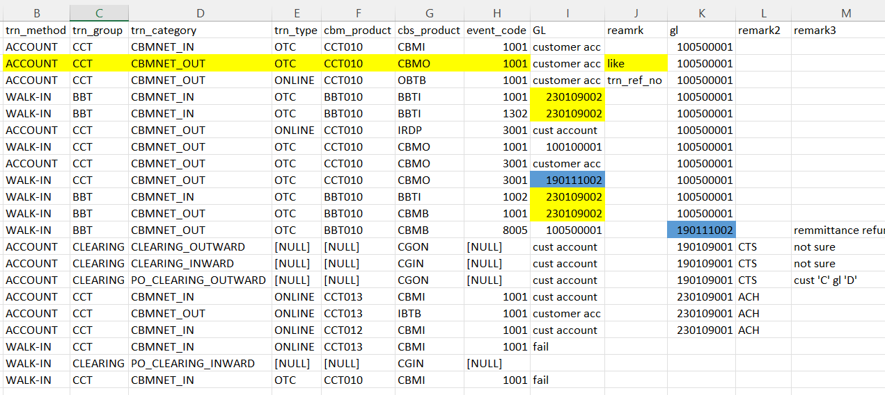

## ACH
- CCT012 and CCT013 
- transaction flow is cust and 230109001

## CTS ()
- transaction flow is cust and 190109001
- this is may be all clearing (not sure)
    - CLEARING_OUTWARD
    - CLEARING_INWARD
    - PO_CLEARING_OUTWARD
    - PO_CLEARING_INWARD



[   this is link for cbm_net clearing](<c:/Users/htetoo.lwin/Desktop/Cbmnet finding/cbm_net summary.xlsx>)


## we need to care on reverse and reversal transaction
- if transaction is complete yesterday but change this status on next day reversal
- need to insert both of transaction or uninsert both to match with settlement transaction

## BBT010 and CCT010 
- transaction flow is cust and CBM GL but no contain cbs_product 8005

## CTS = cbmnet clearing

claring is match for 6 months with ko phyo kyaw

```sql
--------------CTS Only 

with clearing_trans_outward as (
select 
    a.trn_date,
    last_day(a.trn_date) as month_end_date,
    a.other_bank_name,
    a.acc_no,
    isnull(a.cust_no,'') as cust_no,
    a.trn_group,
    a.trn_category,
    a.trn_type,
    a.cbm_product,
    a.trn_status,
    sum(trn_amount) as trn_amount,
    sum(trn_chg) as trn_chg
from 
    kbz_analytics.derive.cbs_cbmnet_clearing_daily_acc_trn a
left join 
    kbz_analytics.cbs.tblinwardreturnitem b
on a.trn_ref_no = b.flduic 
where 
    a.trn_date between '2025-04-01' and '2026-03-31'
    and a.trn_group ='CLEARING'
    and a.cbs_product in ('CGON')
    and b.fldreason ='000' --success only 
group by 
    a.trn_date,
    last_day(a.trn_date),
    a.other_bank_name,
    a.acc_no,
    isnull(a.cust_no,''),
    a.trn_group,
    a.trn_category,
    a.trn_type,
    a.cbm_product,
    a.trn_status    
),
clearing_trans_inward as (
select 
    a.trn_date,
    last_day(a.trn_date) as month_end_date,
    a.other_bank_name,
    a.acc_no,
    isnull(a.cust_no,'') as cust_no,
    a.trn_group,
    a.trn_category,
    a.trn_type,
    a.cbm_product,
    a.trn_status,
    sum(trn_amount*-1) as trn_amount,
    sum(trn_chg*-1) as trn_chg
from 
    kbz_analytics.derive.cbs_cbmnet_clearing_daily_acc_trn a
where 
    a.trn_date between '2025-04-01' and '2026-03-31'
    and a.trn_group ='CLEARING'
    and a.cbs_product not in ('CGON') 
group by 
    a.trn_date,
    last_day(a.trn_date),
    a.other_bank_name,
    a.acc_no,
    isnull(a.cust_no,''),
    a.trn_group,
    a.trn_category,
    a.trn_type,
    a.cbm_product,
    a.trn_status    
)


select
    * 
    into #clr_trans
from 
    clearing_trans_outward
union all 
select 
    * 
from 
    clearing_trans_inward

--select * from #clr_trans

select trn_date, other_bank_name, trn_category, sum(trn_amount) as trn_amount, sum(trn_chg) as trn_chg
from #clr_trans
group by trn_date, other_bank_name, trn_category
order by trn_date, other_bank_name
```


## BBT 
- BBT is not match because of offline transaction 

```sql 
with BBT_trans as (
select 
    --last_day(trn_date) as trn_date,
    --other_bank_name,
    --acc_no,
    --isnull(cust_no,'') as cust_no,
    trn_date,
    trn_group,
    trn_category,
    trn_type,
    cbm_product,
    upper(trn_status) as trn_status,
    sum(case when trn_category = 'CBMNET_OUT' then trn_amount*-1 else trn_amount end) as trn_amount,
    sum(case when trn_category = 'CBMNET_OUT' then trn_chg*-1 else trn_chg end) as trn_chg
from 
    kbz_analytics.derive.cbs_cbmnet_clearing_daily_acc_trn 
where 
    trn_date between '2025-10-01' and '2026-04-28' 
    and trn_group in ('BBT') 
    --and upper(trn_status) in ('COMPLETE', 'INCOMPLETE')
group by 
    --last_day(trn_date),
    --other_bank_name,
    --acc_no,
    --isnull(cust_no,''),
    trn_date,
    trn_group,
    trn_category,
    trn_type,
    cbm_product,
    trn_status
)
,
BBT_trans_reverse as (
select 
    --last_day(r.trn_date) as trn_date, 
    --r.other_bank_name,
    --r.acc_no,
    --isnull(a.cust_no,'') as cust_no,
    trn_date,
    'BBT' as trn_group,
    revr_category as trn_category,
    'REVERSAL' as trn_type,
    '' as cbm_product,
    upper(trn_status) as trn_status,
    sum(trn_amount) as trn_amount,
    0 as trn_chg
from  
    kbz_analytics.derive.cbs_cbmnet_daily_acc_all_revr_trn r
left join kbz_analytics.cbs.sttm_cust_account a 
on r.acc_no = a.cust_ac_no
where 
    trn_date between '2025-10-01' and '2026-04-28' 
    and revr_category not like 'CCT%'
group by 
    --last_day(r.trn_date), 
    --r.other_bank_name,
    --r.acc_no,
    --isnull(a.cust_no,''),
    trn_date,
    revr_category,
    trn_status
)

select * into #BBT from BBT_trans
union all
select * from BBT_trans_reverse

--select * from #BBT
```

## ACH
- ACH is main in cbmnet transaction
- CCT012 and CCT013


