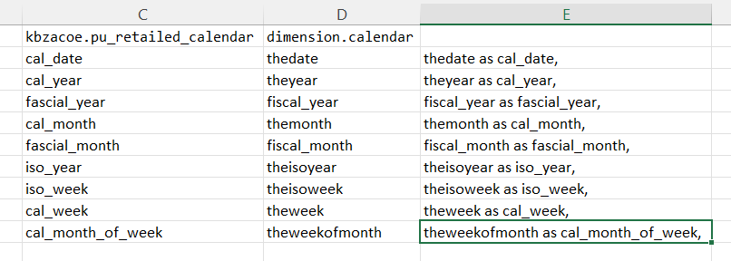

- he request 2025 transaction data with reversal
- this report will help in creating of kpay transaction model


```sql

create or replace PROCEDURE ho_add_by_day(start_date DATE, end_date DATE)
AS $$
DECLARE
    current_date DATE := start_date;
BEGIN
    -- Loop from start_date to end_date
    WHILE current_date <= end_date LOOP
        -- Insert into table
--        INSERT INTO daily_table(report_date, value)
--        VALUES (current_date, 0);  -- replace 0 with any logic or value

	    
	    
select -- distinct debit_party_type , credit_party_type
year_key, month_key, trn_date, trn_type,reason_type,trn_id , -- debit_party_type , credit_party_type,
--case  --- no need now
--	when debit_party_type = 'Organization' then debit_party_id
--	else credit_party_id
--end as org ,
debit_party_type || ' to ' || credit_party_type as def ,
case 
	when debit_party_type = 'Organization' then amount * -1
	else amount
end as amount
into #temp
from kbz_analytics.base.kpay_action_in_trn where trn_date = current_date and  --- 2196200
-- trn_type <> 'Reversal Transaction' and -- call reversal also
(debit_party_type = 'Organization' or credit_party_type = 'Organization')
and trn_status = 'Completed';

----------- 


select year_key,month_key,trn_date ,trn_type,reason_type,def,
sum(case when amount <0   then amount else 0 end ) as debit_total,
sum(case when amount >= 0 then amount else 0 end ) as credit_total,
sum(amount) as net_amt,
count(trn_id) as trn_vol
into #temp2 from #temp
group by year_key,month_key,trn_date ,trn_type,reason_type,def;

------------


select 
t.year_key , t.month_key , t.trn_date ,t.trn_type , t.reason_type,def,
rp.channel,rp.user_type , rp.is_cust_buz_trn , rp.main_product ,rp.sub_product , --- selecting from rp
sum(debit_total) as debit_total,
sum(credit_total) as credit_total,
sum(t.net_amt) as net_amt,
sum(t.trn_vol) as trn_vol
into #temp3
from #temp2 t left join kbz_analytics.dimension.kpay_redapp_product_category rp -- this left join may error becu this is manual file from BU
on t.trn_type = rp.transaction_type and t.reason_type = rp.reason_type 
group by 
t.year_key , t.month_key , t.trn_date ,t.trn_type , t.reason_type,def,
rp.channel,rp.user_type , rp.is_cust_buz_trn , rp.main_product ,rp.sub_product;


insert into acoe_cbs.ho_kpay_org_tran
select * --into acoe_cbs.ho_kpay_org_tran 
from #temp3;

commit;

drop table #temp;
drop table #temp2;
drop table #temp3;

RAISE NOTICE 'Processed data for date: %', current_date;


        -- Move to next day
        current_date := current_date + INTERVAL '1 day';
    END LOOP;
END;
$$ LANGUAGE plpgsql;
```


## matching to correct old model



-----

## this is second path of model

```sql

select year_key , month_key , trn_date , 

    CASE 
        WHEN trn_date >= cast('2025-12-31' as date)  - INTERVAL '7 days' 
        THEN 'Y' ELSE 'N'
    END AS is_last_7days,

    CASE 
        WHEN trn_date >= cast('2025-12-31' as date)  - INTERVAL '30 days' 
        THEN 'Y' ELSE 'N' 
    END AS is_last_30days,
    
    CASE 
        WHEN trn_date >= cast('2025-12-31' as date) - INTERVAL '4 weeks' 
        THEN 'Y' ELSE 'N'
    END AS is_last_4weeks,

    CASE 
        WHEN trn_date >= cast('2025-12-31' as date) - INTERVAL '3 months' 
        THEN 'Y' ELSE 'N'
    END AS is_last_3months,
    
  cal_year, fascial_year , cal_month , fascial_month, iso_year , iso_week , cal_week , cal_month_of_week,
channel as product_channel, user_type, 
is_cust_buz_trn	,trn_type , reason_type ,main_product , sub_product, trn_vol , abs(debit_total) + abs(credit_total) as trn_value
into acoe_cbs.ho_kpay_org_trn_update
from acoe_cbs.ho_kpay_org_tran m 
--left join  
--(
--select cal_date,cal_year, fascial_year , cal_month , fascial_month, iso_year , iso_week , cal_week , cal_month_of_week   
--from kbzacoe.pu_retailed_calendar   
--)cal on m.trn_date = cal.cal_date  

left join
(
select thedate as cal_date,
theyear as cal_year,
fiscal_year as fascial_year,
themonth as cal_month,
fiscal_month as fascial_month,
theisoyear as iso_year,
theisoweek as iso_week,
theweek as cal_week,
theweekofmonth as cal_month_of_week from dimension.calendar 
)cal on m.trn_date = cal.cal_date 

```

