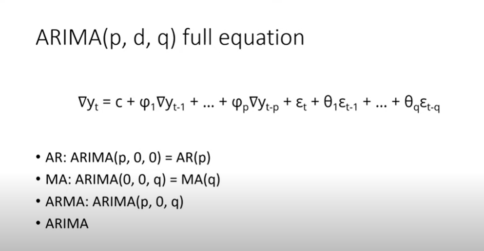

## AR
- AR(P) - the past values included in AR model
 
 $
 Y_{t} = c + \phi_1 Y_{t-1} + \phi_2 Y_{t-2} + ... + \phi_p Y_{t-p} + E_t
 $
 
 ## I
- I(d) - the number of times the time series is differenced

$
\triangledown Y_t = Y_t - Y_{t-1}
$ 

## MA
- MA(q) - the number of past focast error include in the MA model
$
Y_t = c + E_t + \theta_1 E_{t-1} + \theta_2 E_{t-2} + ... + \theta_q E_{t-q}
$ 

## full equation of ARIMA

