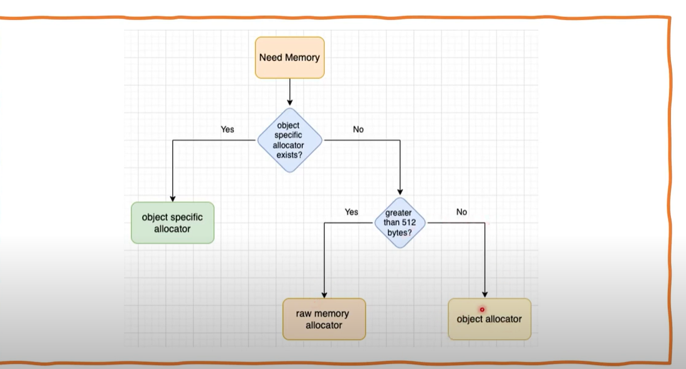

## this is python object understanding

learn 
1. mutable object
2. inmutable object

-------------------------

malloc function - create block when run (example creating an object)

free function - drop the block when refernece = 0

Object in python have 3 attributes  
1. value 
2. type
3. reference count

this path is object-1 
eg. a = 3
value = 3
type = int
reference = 1 (a = 3)
------------

when 
b = a
a = a + 1

b = object-1 
a = object-2 (new object)

-------------------------------- part - 2 

