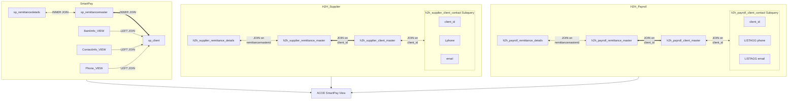

## ACOE_SmartPay_View_New

```mermaid
flowchart TD
    subgraph SmartPay
        A[sp_remittancedetails] <-->|INNER JOIN| B[sp_remittancemaster]
        B <==>|INNER JOIN| C[sp_client]
        D[BankInfo_VIEW] -->|LEFT JOIN| C 
        E[ContactInfo_VIEW] -->|LEFT JOIN| C
        F[Phone_VIEW] -->|LEFT JOIN| C
    end

        subgraph H2H_Supplier
        G[h2h_supplier_remittance_details] <-->|JOIN on<br>remittancemasterid| H[h2h_supplier_remittance_master]
        H <==>|JOIN on<br>client_id| I[h2h_supplier_client_master]
        I <-->|JOIN on<br>client_id| J[Contact Aggregation]
        
        subgraph J [h2h_supplier_client_contact Subquery]
            direction LR
            M[client_id]
            K[Lphone]
            L[email]
        end
    end
    subgraph H2H_Payroll
        N[h2h_payroll_remittance_details] <-->|JOIN on<br>remittancemasterid| O[h2h_payroll_remittance_master]
        O <==>|JOIN on<br>client_id| P[h2h_payroll_client_master]
        P <-->|JOIN on<br>client_id| Q[Contact Aggregation]
        
        subgraph Q [h2h_payroll_client_contact Subquery]
            direction LR
            R[client_id]
            S[LISTAGG phone]
            T[LISTAGG email]
        end
    end

    SmartPay --> U[ACOE SmartPay View]
    H2H_Supplier --> U
    H2H_Payroll --> U

    
```

